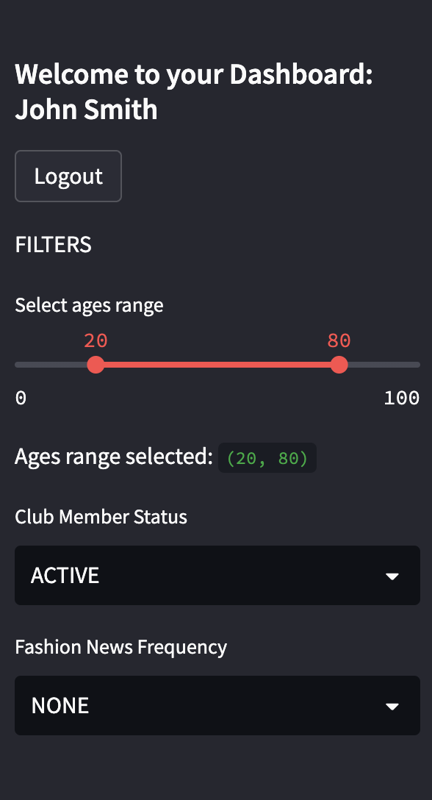
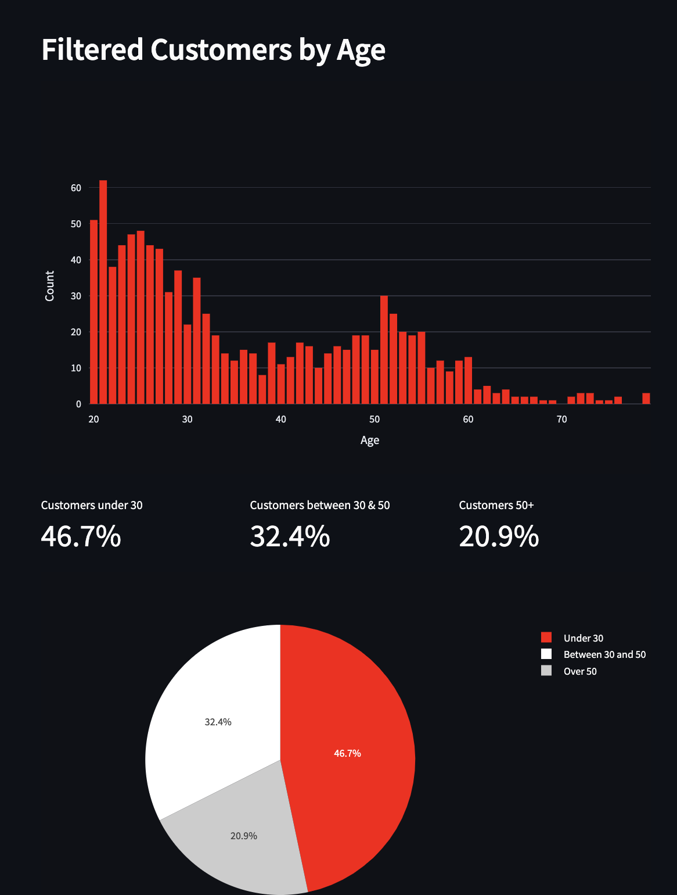

# H&M - Business Challenge Project

### KPIs visualisation with Streamlit

### Project Objectives:

The challenge is based on an H&M real dataset.
The business challenge is focused on the need to measure the main purchase products and their key performance indicators (KPI) as critical for the business.
The project consists of developing an application to visualize the main purchase products and their key performance indicators (KPI)and trends over time and to deploy it in public cloud infrastructureso that H&M users can access it in order to monitor the item purchases.

### Project Outlines:

1. Login Page:
   

2. Tabs:
   

3. Side Bar (Customers):
   

4. KPIs (Customers):
   

5. Graphs (Customers):
   
